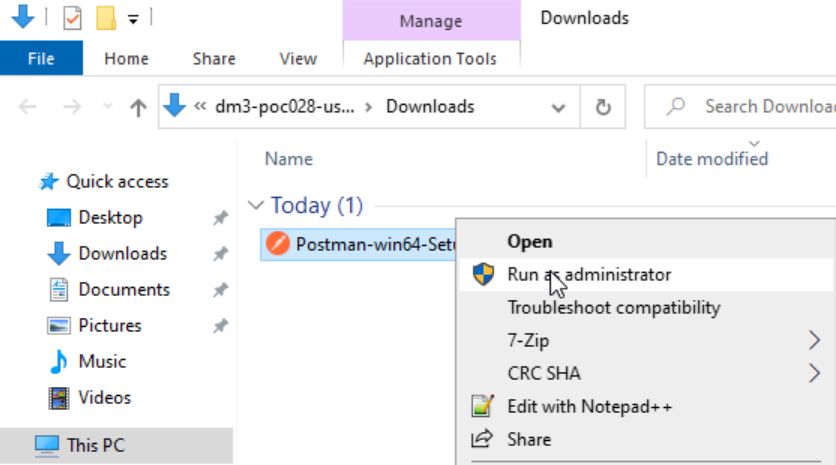
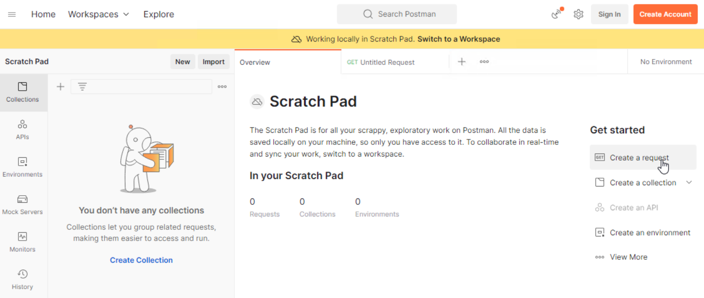

:::info

The estimated time to complete this lab is **90 minutes**.

:::

# Pre-requisite:

1.  This course assumes the trainees have basic knowledge of Calm and understand the constructs in Calm.
2.  **Python** knowledge would be an added advantage but not essential.
3.  This lab requires the use of Postman. Download and install [Postman](https://www.postman.com/downloads). 
    - For **Nutanix employee, install it in your Mac/PC and connect to the VPN**. 
    - For **partners & customers, install it in the VDI desktop**. 

# Purpose of the lab

Nutanix Calm Marketplace and ServiceNow integration allowed our customer to provide self service of the underlying infrastructure like VM as a
Service, Database as a Service, Kubernetes as a Service and Application as a Service etc. However, some of our customers would like to use a 3rd
party Cloud Management Portal or IT Service Management software like BMC Remedy, ManageEngine etc. How can we help this group of customers to
achieve this?

One of the key benefits in our Private Cloud solution was to bring public cloud experience into the private cloud. Automation was a key driver behind this. The objectives were to equip our automation SMEs
with the skill sets to help our customers to streamline the process and integrate with disparate technologies through the use of api.

# Install Postman

1.  Open a Chrome browser and search for Postman

2.  Right click and install as administrator

    

3.  Click on **skip and go to the app**

    

4.  Click on **Create a request**

    

# Understand the Nutanix APIs

These operations were available in the Prism Central v3 API.
(<https://www.nutanix.dev/reference/prism_central/v3/>).

Nutanix APIs were available in REST (Representational State Transfer).
REST service could be easily consumed by the different browsers and 3rd
party integrations in the familiar HTTP and HTTPS protocol. These
operations were available in the HTTP/HTTPS protocol and each operation
served a purpose.

1.  **GET** Retrieve representation of the member resource in the
    response body.
2.  **POST** Create a member resource in the member resource using the
    instructions in the request body
3.  **PUT** Replace all the representations of the member resource with
    the representation in the request body.
4.  **PATCH** Update all the representations of the member resource or
    may create the member resource if it does not exist, using the
    instructions in the request body.
5.  **DELETE** Delete all the representations of the member resource

Each API call would comprise of the following:

1.  URL of the REST service

2.  Authentication & Authorization

3.  Type of Authentication: BASIC

4.  Username

5.  Password

6.  Request Parameters. The no of request parameters were dependent on
    the API.

7.  Each API call would return the following status code:

    > -   200, 201 (OK)
    > -   404 (Not Found)
    > -   403 (Authorization Error)
    > -   500 (Internal Server Error)

8.  Response Parameters. The no of response parameters were dependent on
    the API

# Use Nutanix for Day 2 Operation

## Clone the centOS VM

The purpose for cloning the Centos VM is to allow the trainee to change
the memory of the Centos VM.

1.  Click on **Virtual Infrastructure-\>VM**.

    

#\. Click on **Clone**. Name it to **CentOS\<trainee number\>**

:   

# Change the VM Memory

## Use Case

The application team may change the memory of the VM for the application
optimum performance. The application team would want to perform a self
service to change the memory.  This op

## Translate the use case into api operation

The use case could be translated into 3 operations:

1.  Retrieve a list of VMs for the user to select
2.  Change to the new memory size and power off the VM
3.  Power on the VM

## Operation 1: Retrieve a list of VM for the user to select

1.  Click on the link to examine the api to retrieve a list of VMs in
    the Nutanix clusters.

    > <https://www.nutanix.dev/reference/prism_central/v3/api/vms/postvmslist/>

2.  

    Each API call would comprise of the following:

    :   -   URL of the REST service. **https://\<Prism Central
            IP\>:9440/api/nutanix/v3/vms/list**

        -   

            Authentication & Authorization

            :   -   Type of Authentication: **BASIC**

                -   Username: **admin**

                    > -   Password: \<Prism Central Password\>

        -   These are the request parameters.

            > 

        -   This is an example of the request parameter.

    ``` bash
    "kind": "vm",
    "sort_order": "ASCENDING",
    "offset": 0,
    "length": 256,
    "sort_attribute": "vm_name"
    ```

## API Verification with Postman

1.  Open the **Postman**. Key in the **URL of the Prism Central**. This
    is a **POST** request

    

2.  Fill in the following in the **Authorization** tab.

    

3.  Fill in the **Header**.

    

4.  Fill in the following in the **Body**.

    

5.  Click on **Send**

    

6.  Scroll down to view the **response of the REST service call**. This
    is an example of successful response

    

7.  Take note of the response structure. The **VM name** was in
    **entities.metadata.name**. The **VM uuid** was in
    **entities.metadata.uuid**. The VM name was used to display for user
    selection.

    

## Create a dynamic variable in Calm

1.  The purpose of this section is to create a drop down list of the VMs
    in the Nutanix cluster for user selection.

2.  Login into Prism Central and go into Nutanix Calm. Open the
    blueprint

3.  Create the following variables:

    > -   PC_IP **Store the value for Prism Central IP**
    > -   newMemSize **Store the value for New Memory Size in Mb**
    >
    > > 

4.  Check the **Mark this variable mandatory** to allow the user to key
    in the new memory size.

    

5.  Create a dynamic variable named vmname

    

6.  Examine the following python scripts. This section of the python
    script configured the user name, password, Prism Central IP address
    (destination for the api) and the request structure. Copy this
    contents into the escript

    > ``` python
    > user = "admin"
    > password = "Fill in the password in your PC"
    > ip = "Fill in the PC IP"
    >
    > def process_request(url, method, user, password, headers, payload=None):
    >  r = urlreq(url, verb=method, auth="BASIC", user=user, passwd=password, params=payload, 
    > verify=False, headers=headers)
    > return r
    > ```

7.  The payload was the mandatory request parameters to be passed into
    the api. Please copy the contents into the escript

    > ``` python
    > payload = {
    >  "kind": "vm",
    >  "sort_order": "ASCENDING",
    >  "offset": 0,
    >  "length": 256,
    >  "sort_attribute": "vm_name"
    > }
    > ```

8.  This section of the python script was to invoke the request to the
    api. Copy this section of the scripts into the escript

    > ``` python
    > base_url = "https://" + ip + ":9440/api/nutanix/v3/vms"
    > url = base_url + "/list"
    > headers = {'Accept': 'application/json', 'Content-Type': 'application/json'}
    > url_method = "POST"
    >
    > r = process_request(url, url_method, user, password, headers, json.dumps(payload))
    > ```

9.  This section of the python script was to extract the vm name from
    the api response

    > ``` python
    > vm_list = []
    > vm_list_json = r.json()
    > for vm in vm_list_json['entities']:
    >  if vm['spec']: #sometimes this value will be '{}'
    >    vm_list.append("{}".format(vm['spec']['name']))
    >
    > print ','.join(vm_list) 
    > ```

10. This was the picture of the consolidated script.

    

11. Launch the blueprint to check on the display for the selection of
    the VM.

    

## Operation 2: Retrieve the VM details, Update the new memory and power off the VM

1.  Go to the **Service** on the right side of the screen. Change the
    **Cloud** from **Nutanix** to **Existing Machine**. Changing the VM
    memory is not to provision but automating on an existing machine.

    

2.  Fill in an **IP address**. Since the execution was based on the
    selection of the VM, the contents in this field does not matter.

    

3.  Click on **Package-\>Install**. Click on **+ Task**

    

4.  Name the task: **UpdateMemory**

    > -   Type: Execute
    > -   Script Type: Escript

    

5.  Refer to the following api to update the specification of the VM

    > <https://www.nutanix.dev/reference/prism_central/v3/api/vms/putvmsuuid/>

6.  Copy the contents into the escript. This section of the escript
    defines the following:

    > -   Credential
    > -   Destination of the API: \<Prism Central\>
    > -   Define the structure for the http request.
    >
    > ``` python
    > user = "@@{PC.username}@@"
    > password = "@@{PC.secret}@@"
    > ip = "@@{PC_IP}@@"
    >
    > def process_request(url, method, user, password, headers, payload=None):
    > r = urlreq(url, verb=method, auth="BASIC", user=user, passwd=password, params=payload, verify=False, headers=headers)
    > return r
    > ```

7.  Copy the contents into the escript. This section of the escript
    define the request parameters to filter the specific VM instead of
    all the VMs in the cluster.

    > ``` python
    > payload = {
    >  "filter": "vm_name==@@{vmname}@@",
    >  "kind": "vm",
    >  "sort_order": "ASCENDING",
    >  "offset": 0,
    >  "length": 256,
    >  "sort_attribute": "vm_name"
    > }  
    > ```

8.  Copy the contents into the escript. This section will execute and
    retrieve the specific VM.

    > ``` python
    > base_url = "https://" + ip + ":9440/api/nutanix/v3/vms"
    > url = base_url + "/list"
    > headers = {'Accept': 'application/json', 'Content-Type': 'application/json'}
    > url_method = "POST"
    >
    > r = process_request(url, url_method, user, password, headers, json.dumps(payload))
    > print "Response Status: " + str(r.status_code)
    > vm_list_json = r.json()
    > for vm in vm_list_json['entities']:
    >  if vm['spec']: #sometimes this value will be '{}'
    >    if (vm['spec']['name'] == "@@{vmname}@@"):
    >      vm_json = vm   
    > ```

9.  Copy the contents into the escript. This section manipulates the
    json contents to change to the new memory size and power off the VM.

    > ``` python
    > del vm_json['status']
    > del vm_json['spec']['resources']['memory_size_mib']
    > del vm_json['spec']['resources']['power_state']
    >
    > vm_json['spec']['resources']['memory_size_mib'] = @@{newMemSize}@@
    > vm_json['spec']['resources']['power_state'] = "OFF"
    > print "VM JSON: " + json.dumps(vm_json)
    > ```

10. Copy the contents into the escript. This section will put the new
    json specification to the Prism Central to execute the changes. If
    Prism Central executed the changes successfully, it will return
    exit 0. Otherwise, it is exit 1.

    > ``` python
    > url = base_url + "/" + str(vm_json['metadata']['uuid'])
    > url_method = "PUT"
    > r = process_request(url, url_method, user, password, headers, json.dumps(vm_json))
    > print "Response Status: " + str(r.status_code)
    > print "Response: ", r.json()
    > if (r.ok):
    >  sleep(120)
    >  exit(0)
    > else:  
    >  exit(1)  
    > ```

11. Launch the Blueprint.

    

12. Click on the **Audit** tab of the application. Expand the **Create**

    

13. Observe the section on the **Update Memory**

    

14. Go to **Virtual Infrastructure-\>VMs**

    

15. Drill into **CentosVM**

    

## Operation 3: Power on the VM

1.  Create another task to power up the VM.
2.  Fill up the contents of the escript based on the learning till date.
3.  The end result is the memory of the VM was changed and powered on.
