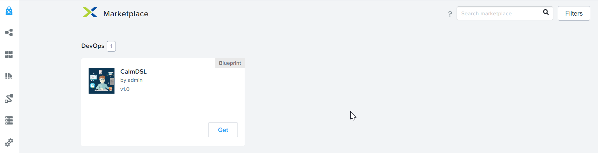
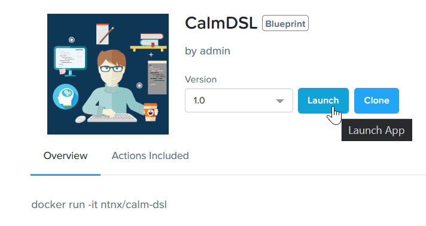
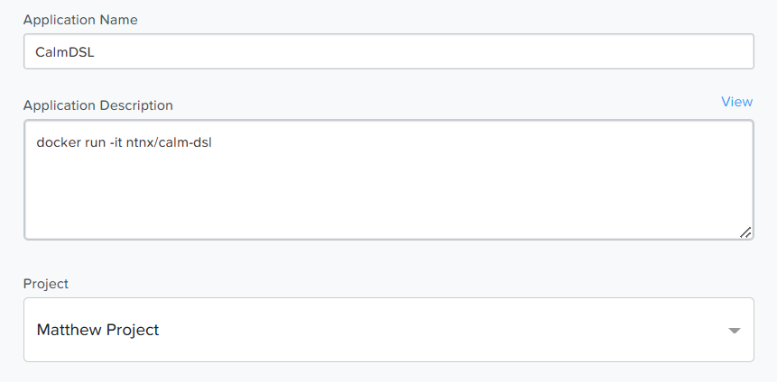
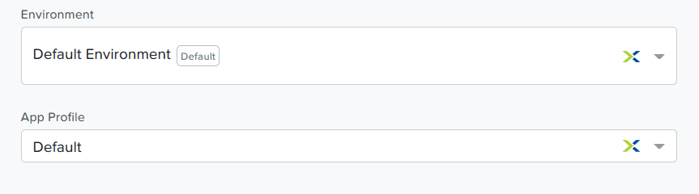
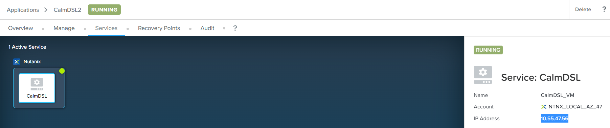
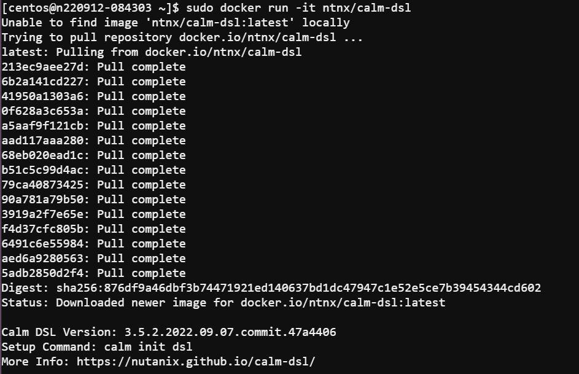
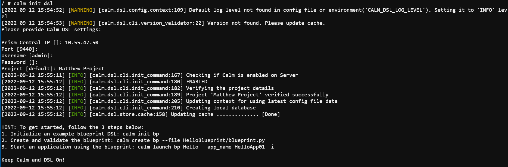

# Calm: Quickstart DSL

# Product Configuration:

1.  Calm 3.5.2 on PC2022.6

## Overview

### Setup

To start the DSL lab we have provided a [DevWorkStation.json](<https://raw.githubusercontent.com/bmp-ntnx/QuickStartCalmDSL/master/DevWorkstation.json>)
blueprint to quickly get you started. The included DevWorkstation.json builds a CentOS VM with all the necessary tools. This blueprint can be
launched directly from Calm. Publish it to the Calm Marketplace for Self Service. 

The icon picture required to publish into the Calm Marketplace could be downloaded [here](<https://github.com/bmp-ntnx/QuickStartCalmDSL/blob/master/software-developer.png>).

### Launch DevWorkstation from Calm Marketplace

1.  Go to the Calm Marketplace to launch the provisioning of the DevWorkstation.

    

2.  Click on **Launch** 

    

3. Fill in the **application name**.  Click **Deploy**

    
    


4.  Once the application is **running** SSH to the DevWorkstation

    The IP address of the DevWorkstation is listed under the **Services**. The SSH user/pass is what was set under the credentials tab.

   

    
### Connect to Calm

1.  Run the following command to start the Docker container

    ```bash
    sudo docker run -it ntnx/calm-dsl
    ```

    

2.  This step is necessary when the docker client session have expired.  Execute into the docker container.    
    
    ```bash
    sudo docker exec -it friendly_jennings /bin/bash
    ```

3.  Run this command to connect to Calm.  Calm can exist in Calm VM or within the Prism Central.

    ```bash
    calm init dsl 
    ```

4.  Fill in the following details:

    Prism Central IP: **Calm VM IP**
    Port: **9440**
    Username: **admin**
    Passowrd: **Calm VM Password**
    Project: **Your Project**

    

4.  Verify the current config settings by running
    
    ```bash
    calm show config
    ```

    

### List the current blueprints in Calm

1.  To check all the blueprints in Calm with their UUID, description, application count, project, and state, run the following command:

    ```bash
    calm get bps
    ```

    

1.  Run the following to display quiet output with only the BP names

    ```bash
    calm get bps
    ```

    

1.  Review python based blueprint and make a modification

2.  Change to the **HelloBlueprint** directory and run ls

    ```bash
    cd HelloBlueprint
    ls 
    ```

    This directory and it's contents were automatically created during the blueprint launch. As part of the DevWorkstation blueprint launch we ran `` `calm init bp ``\` which creates a 
    sample blueprint configured to the connected Calm instance here is a file called ``blueprint.py`` which is a python version of a blueprint

    There is a ``scripts`` directory. This is where the  bash/powershell/python scripts are stored that are referenced within the blueprint

    

1.  Edit the blueprint using the vi/nano editors

    ```bash
    vi blueprint.py
    ```

2.  Review the blueprint for familiar constructs. To skip directly to a line enter ``:<linenumber>`` inside your ``vi`` console

    -   Credentials (line 54-60)
    -   OS Image (line 62-66)
    -   Under class HelloPackage(Package) you will see references to the pkg_install_task.sh script in the scripts directory (line 139)
    -   Basic VM spec information (vCPU/memory/disks/nics) (line 153-159)
    -   Guest Customization contains cloud-init (line 161-171)

3.  In the blueprint.py modify the number of vCPU

    -   Change the vCPU from 2 to 4 (line 154)

    

1.  Add a unique VM name using a macro (line 185)

    ```bash
    provider_spec.name = "<Initials>-@@{calm_unique}@@"``
    ```

    

1.  Write/quit ``:wq`` the .py blueprint file to save and close
2.  Modify pkg_install_task.sh
3.  Change to the scripts directory and run ``ls``. We will see 2 scripts that are being referenced inside blueprint.py
    ```bash
    ls
    ```
    
4.  Run the following command to view the current contents of the install script. What does the script do?
    
    ```bash
    cat pkg_install_task.sh
    ```

   

1.  Run the following command to replace the existing install script

    ```bash
    curl -Sks https://raw.githubusercontent.com/bmp-ntnx/prep/master/nginx > pkg_install_task.sh 
    ```
    
2.  Run  the following to view the changed script. What does the script do now?
    
    ```bash
    cat pkg_install_task.sh 
    ``` 

    

1.  Push the modified blueprint.py to Calm
2.  Return to the **HelloBlueprint** directory

    -   Run the following command

        ```bash
        calm create bp --file blueprint.py --name FromDSL-<Initials> 
        ```

        This converts the .py file to json and pushes it to Calm

        

    -   **Optional:** Run  the following to view the python blueprint in json format from DSL

        ```
        calm compile bp -f blueprint.py 
        ```

    -   Verify your new blueprint by running

        ```bash
        calm get bps -q | grep FromDSL-<Initials> 
        ```

        

### Launch the blueprint into an application

1.  Run this following command to verify all the current applications before launching your new app

    ```bash
    calm get apps 
    ``` 

2.  Run this following command  to quiet the details like we did with blueprints earlier

    ```bash
    calm get apps -q 
    ```

3.  Launch your newly uploaded blueprint into an application

4.  Run this following command 

    ```bash
    calm launch bp FromDSL-<Initials> --app_name AppFromDSL-<Initials> -i 
    ```

    

1.  Run the following command to see the application summary. Once the app status changes to **running** we will have a nginx server deployed from Calm DSL!

    ```bash
    calm describe app AppFromDSL-<Initials> 
    ```

    

1.  Run the following command to search the json output for the VM IP

    ```bash 
    calm describe app AppFromDSL-<Initials> --out json | grep -F '[{\"ip\":\"' 
    ```
    
2.  Now we need to get the VM/Application IP address. To get this we will pull the \"address\" from the application json output using jq
    by running the following:

    ```bash
    calm describe app AppFromDSL-<Initials> --out json | jq '.status.resources.deployment_list[].substrate_configuration.element_list[].address' 
    ```

    
    
    

1.  Enter the IP in a web browser and this will take you to the nginx **Welcome to DSL** web page

    

1.  Log into Prism Central to verify
    -   Check the blueprint created from DSL
    -   Check the application launched from DSL

Looking back - as you went through this lab not only did you use Calm DSL, but you also used several native Linux tools such as vi, curl, grep, cat, pipe, and
redirects. Calm DSL allows extended flexibility by combining it with these powerful tools. Think about how you can add git to this workflow
to track changes or modify blueprints with ``sed`` command.

### Optional: Getting started with git

Speaking of git lets contiue on and push our blueprint to git. We will need a github.com account before you can get started

1. Logon to git and create new repo **dsl-blueprints**

2. From the **HelloBlueprint** directory run the following commands:

   ```bash title="to create a README file"
   echo "# dsl-blueprints" >> README.md 
   ```

   ```bash title="to initialize git in your working directory"
   git init
   ```

   ```bash title="identify your git email"
   git config --global user.email "<youremail>@example.com" 
   ```

   ```bash title="identify your git username"
   git config --global user.name "<GitUserName>" 
   ```
   ```bash title="because colors are cool"
   git config --global color.ui true 
   ```

   ```bash title="to add your new github repo"
   git remote add origin https://github.com/<GitUserName>/dsl-blueprints.git
   ```
    
   ```bash title="to verify your remote origin"
   git remote -v 
   ```
   
   
   
   ```bash title="to see whats being tracked"
   git status 
   ``` 
   ```bash title="adds all files in the current directory into staging"
   git add --all 
   ``` 
   ```bash title="to see the change after adding the files"
   git status 
   ``` 
   

1.  From the above output we can see there are some keys, so lets remove those since this is being pushed to a public repo

    ```bash
    git rm --cached .local -r ``\`
    ```
    ```bash title="to verify the files were removed"
    git status 
    ``` 
    
    

    ```bash title="to commit the files"
    git commit -m "My DSL blueprints" 
    ``` 
    
    
    ```bash title="to push to git"
    git push -u origin master 
    ```  
    You will be prompted for your user/pass unless you setup key access to github

    

    Check your github repo and verify your files were pushed.

### Change the memory for the subtrate

1.  Now that your blueprints exists in both Calm and github lets
    increase the memory to 8 in the blueprint by running:

    ```bash title="use the linux sed tool to change the memory config"
    sed -i 's/memory = 4/memory = 8/g' blueprint.py 
    ```
    
    ```bash
    git add blueprint.py 
    ```
    ```bash
    git commit -m "change memory" 
    ```
    ```bash
    git push -u origin master
    ```

2.  Back in github there should be a new version under the **history** of blueprint.py with the changed memory

    
