# Pre-requsities

1.  In Prism Central, Micro-service infrastructure is enabled
2.  In Prism Central, Advanced Networking is enabled
3.  Prism Central version is at least 2022.1.02
4.  Calm version is at least 3.5.0

# Overview

Virtual Private Cloud (VPC) allowed the service provider to onboard and isolate the underlying infrastructure and network for each tenant.

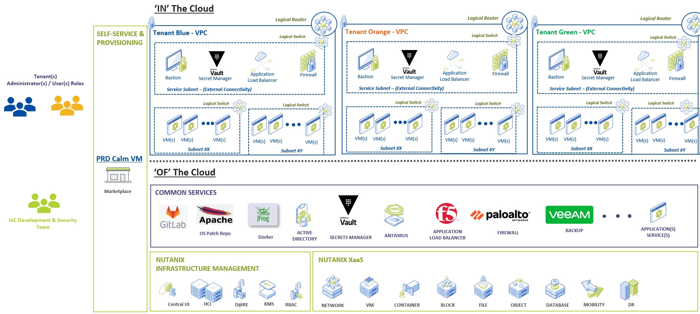

## Create a blueprint to create Virtual Private Cloud (VPC)

1. Click on **Create Blueprint**. Create a **Multi VM/Pod** blueprint.

   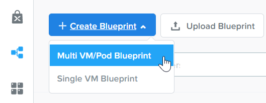

1. Key in the blueprint name. Eg **vpc_initials**

2. Select the **Credentials** tab. Create a new credential for **PC Credential** and enter desired User/Password

   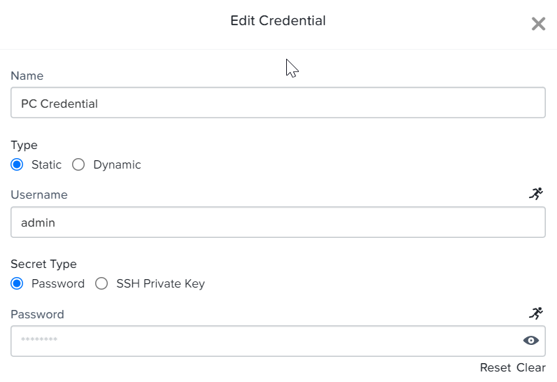

1. Create the following variables on the right side of the screen.

   - Variable Name: **vpc_name** Default value: empty. **Mark this variable mandatory**
   - Variable Name: **external_routable_ip** 
   - Default value:  **10.x.x.x/28. Get this IP address from the instructor**. **Mark this variable mandatory**
   - Variable Name: **dns** Default value: **8.8.8.8**. **Mark this variable mandatory**
   - Variable Name: **PC_IP** Default value: **Follow the cluster PC given by the instructor. Eg 10.x.x.x**
 
   

1. Create the following dynamic variable: **external_subnet** on the  right side of the screen. Select Input Type: **escript**

   

1. **Replace the password with the Prism Central password.**

2. Paste the following script in the script window

   ```python
   user = "admin"
   password = "x.x.x.x"
   ip = "@@{PC_IP}@@"
   payload = {
   "kind": "subnet"
   }
   base_url = "https://" + ip + ":9440/api/nutanix/v3/subnets"
   url = base_url + "/list"
   headers = {'Accept': 'application/json', 'Content-Type': 'application/json'}
   url_method = "POST"
   r = urlreq(url, url_method, auth="BASIC", user=user, passwd=password, params=json.dumps(payload), verify=False, headers=headers)
   subnet_list = []
   subnet_list_json = r.json()
   for subnet in subnet_list_json['entities']:
     subnet_list.append("{}".format(subnet['spec']['name']))
     print ','.join(subnet_list)
  ```

1. On the left hand side of the screen, Add a service.

   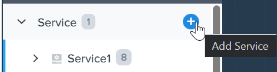

1. On the right hand side of the screen, select **Existing Machine** for account name

   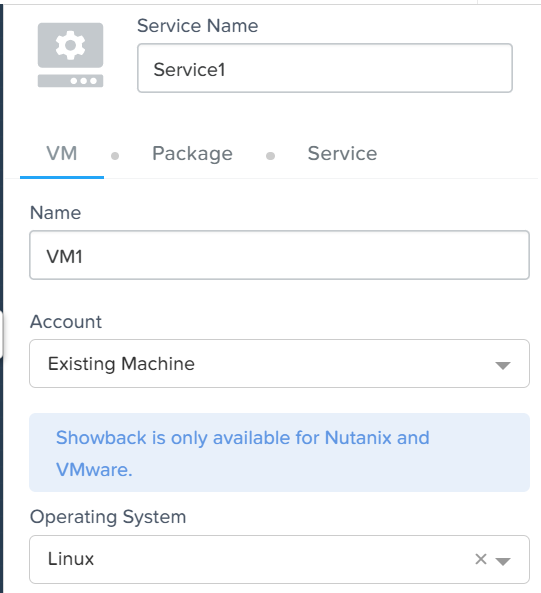

1. On the right hand side of the screen

   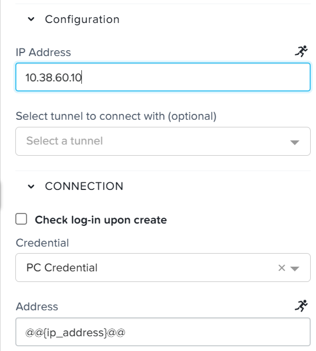

1. On the left hand side of the screen, create a service action: **Create VPC**

   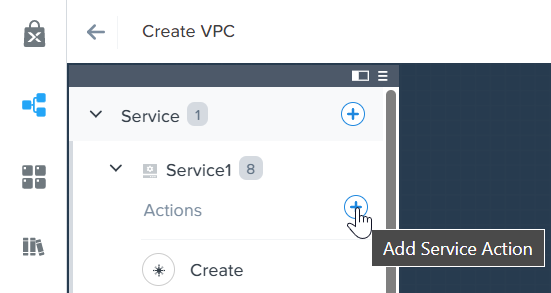

1. On the service, click **Create Task**.

   - Task Name: **GetNetworkUUID**
   - Type: **Set Variable**
   - Script Type: **EScript**
   - Output: **pe_network_UUID**

   ```python
   user = "@@{PC Credential.username}@@"
   password = "@@{PC Credential.secret}@@"
   ip = "@@{PC_IP}@@"

   payload = {

   }

   base_url = "https://" + ip + ":9440/api/nutanix/v3/subnets"
   url = base_url + "/list"
   headers = {'Accept': 'application/json', 'Content-Type': 'application/json'}
   url_method = "POST"
   r = urlreq(url, url_method, auth="BASIC", user=user, passwd=password, params=json.dumps(payload), verify=False, headers=headers)
   subnet_list = []
   subnet_list_json = r.json()
   for subnet in subnet_list_json['entities']:
    if subnet['spec']['name'] == "@@{external_subnet}@@":
      print "pe_network_UUID={}".format(subnet['metadata']['uuid'])
      exit(0)
   exit(1)
   ```

1. On the service, click **Create Task**

   - Task Name: **Split external routable ip**
   - Type: **Set Variable**
   - Script Type: **EScript**
   - Output: **ext_routable_ip**
   - Output: **ext_routable_ip_prefix**

  ``` python
  ext_routable_ip = "@@{external_routable_ip}@@"

  ext_routable_ip_array = [] 
  ext_routable_ip_array = ext_routable_ip.split("/")
  print "ext_routable_ip={0}".format(ext_routable_ip_array[0])
  print "ext_routable_ip_prefix={0}".format(ext_routable_ip_array[1])
  ```

1.  On the service, click **Create Task**.

  - Task Name: **Invoke API to create VPC**
  - Type: **Execute**
  - Script Type: **EScript**

  ``` python
  user = "@@{PC Credential.username}@@"
  password = "@@{PC Credential.secret}@@"
  ip = "@@{PC_IP}@@"
  payload = {
    "spec": {
      "name": "@@{vpc_name}@@",
      "resources": {
        "common_domain_name_server_ip_list": [
        { 
          "ip": "@@{dns}@@"
        }
        ],
        "external_subnet_list": [
        {
          "external_subnet_reference": {
            "kind": "subnet",
            "uuid": "@@{pe_network_UUID}@@"
          }
        }
        ],
        "externally_routable_prefix_list": [
        {
          "ip": "@@{ext_routable_ip}@@",
          "prefix_length": @@{ext_routable_ip_prefix}@@
        }
        ]
      }
    },
  #  "description": "on prem VPC",
    "api_version": "3.0",
    "metadata": {
      "kind": "vpc",
      "categories": {
        "VirtualNetworkType": "Tenant"
      }
    }
  }
  url = "https://" + ip + ":9440/api/nutanix/v3/vpcs"
  headers = {'Accept': 'application/json', 'Content-Type': 'application/json'}
  url_method = "POST"
  r = urlreq(url, url_method, auth="BASIC", user=user, passwd=password, params=json.dumps(payload), verify=False, headers=headers)
  print "Status code: {}".format(r.status_code)
  print "Output: {}".format(r.text)
  if r.ok:
    print "VPC {0} is created successfully".format("@@{vpc_name}@@")
  else:
    exit(1)
  ```

1. On the left side of the screen, click on **Package: Install**

   

1. Click on **+ Action**

   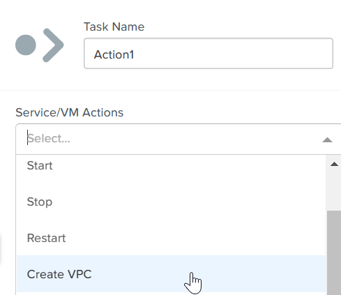

1. Let's create the service action to delete the VPC. On the left hand side of the screen, create a service action: **Delete VPC**

   

1. On the service, click **Create Task**.

   - Task Name: **Get VPC UUID**
   - Type: **Set Variable**
   - Script Type: **EScript**
   - Output: **vpc_uuid**

  ```python
  user = "@@{PC Credential.username}@@"
  password = "@@{PC Credential.secret}@@"
  ip = "@@{PC_IP}@@"

  payload = {}

  base_url = "https://" + ip + ":9440/api/nutanix/v3/vpcs"
  url = base_url + "/list"
  headers = {'Accept': 'application/json', 'Content-Type': 'application/json'}
  url_method = "POST"
  r = urlreq(url, url_method, auth="BASIC", user=user, passwd=password, params=json.dumps(payload), verify=False, headers=headers)
  #print "Status code: {}".format(r.status_code)
  #print "Output: {}".format(r.text)
  vpc_list = []
  vpc_list_json = r.json()
  for vpc in vpc_list_json['entities']:
    if vpc['spec']['name'] == "@@{vpc_name}@@":
      print vpc['spec']['name']
      print "vpc_uuid={0}".format(vpc['metadata']['uuid'])
      exit(0)
  exit(1)  
  ```

1. On the service, click **Create Task**.

  - Task Name: **Invoke API to delete VPC**
  - Type: **Execute**
  - Script Type: **EScript**

  ``` python
  user = "@@{PC Credential.username}@@"
  password = "@@{PC Credential.secret}@@"
  ip = "@@{PC_IP}@@"
  payload = {
  }
  url = "https://" + ip + ":9440/api/nutanix/v3/vpcs/@@{vpc_uuid}@@"
  headers = {'Accept': 'application/json', 'Content-Type': 'application/json'}
  url_method = "DELETE"
  r = urlreq(url, url_method, auth="BASIC", user=user, passwd=password, params=json.dumps(payload), verify=False, headers=headers)
  print "Status code: {}".format(r.status_code)
  #print "Output: {}".format(r.text)
  if r.ok:
    print "VPC {0} is created successfully".format("@@{vpc_name}@@")
  else:
    exit(1)
  ```

1. Associate the **Delete VPC** action with the **Package uninstall** action. Click on **+ Action**. Choose the **Delete VPC** action.

   

1. Click on **Launch** 
    
   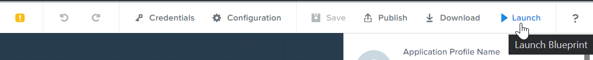

1. Enter the name of Application **VPC-INITIALS** and fill out the form with the requested information. Press **Deploy**

   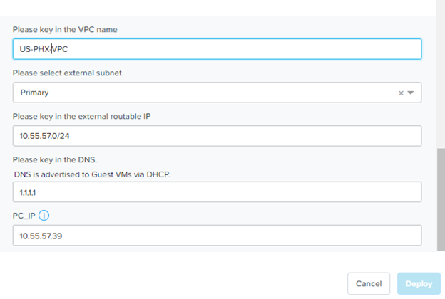

1. Once the application is **running**. Let's look at the audit log.

   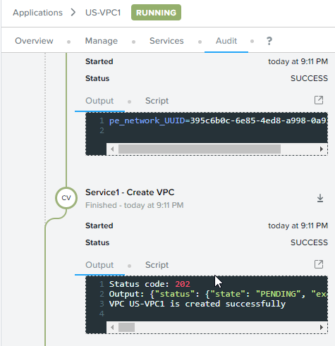

1. In Prism Central **Network and Security** **Virtual Private Cloud**, let's look at the newly created VPC

   

1. Drill into the VPC to look at its details

   

1. Add in a static route to allow the Calm Policy VM to communicate with the Calm Tunnel VM. Click on **Routes**. Click on **Manage Static Routes**

   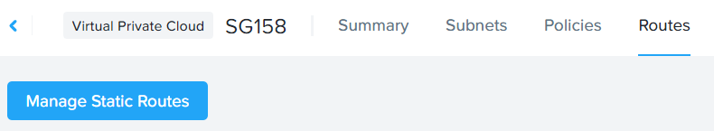

1. Click on **Add Static Route**

   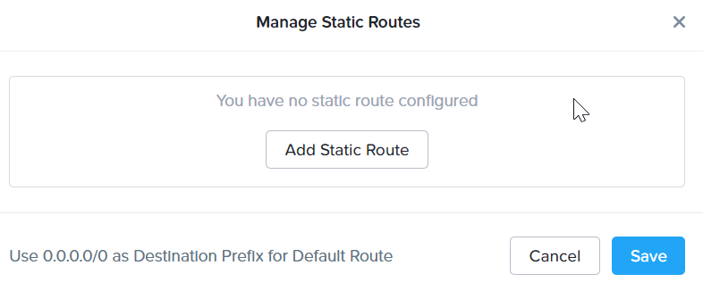

1. Fill in the following:

   - Destination Prefix: **0.0.0.0/0**
   - Next Hop: **Secondary**

1. Click on **Save**

   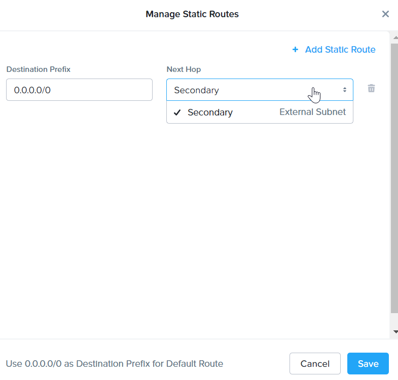

## Create a blueprint to create subnet into VPC

1. Click on **Create Blueprint**. Create a **Multi VM/Pod** blueprint.

   

1. Key in the blueprint name. Eg **subnet_vpc_initial**

2. Select the **Credentials** tab. Create a new credential for **PC Credential** and enter desired User/Pass\*\*

   

1. Create the following variables on the right side of the screen.

   - Variable Name: **subnet_name** Default value: empty. **Mark this variable mandatory**
   - Variable Name: **Gateway_IP** Default value: **192.168.1.1**. **Mark this variable mandatory**
   - Variable Name: **Network_IP_Prefix** Default value: **192.168.1.0/24**. **Mark this variable mandatory**
   - Variable Name: **Start_IP** Default value: **192.168.1.10**. **Mark this variable mandatory**
   - Variable Name: **End_IP** Default value: **192.168.1.30**. **Mark this variable mandatory**
   - Variable Name: **PC_IP** Default value: **Follow the cluster PC given by the instructor. Eg 10.x.x.x**
   
   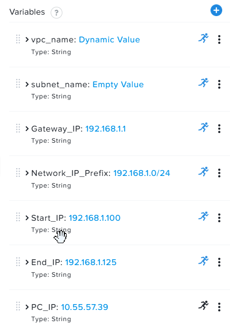

1. Create the following dynamic variable: **vpc_name** on the right side of the screen. Select Input Type: **escript**

   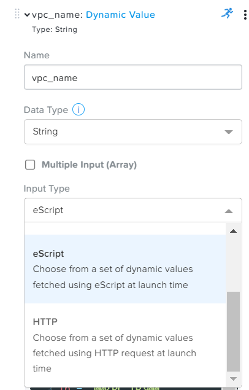

1. **Replace the password with the Prism Central password.**

  ```python
  user = "admin"
  password = "xxxxxxxx"
  ip = "@@{PC_IP}@@"
  payload = {}
  base_url = "https://" + ip + ":9440/api/nutanix/v3/vpcs"
  url = base_url + "/list"
  headers = {'Accept': 'application/json', 'Content-Type': 'application/json'}
  url_method = "POST"
  r = urlreq(url, url_method, auth="BASIC", user=user, passwd=password, params=json.dumps(payload), verify=False, headers=headers)
  #print "Status code: {}".format(r.status_code)
  #print "Output: {}".format(r.text)
  vpc_list = []
  vpc_list_json = r.json()
  for vpc in vpc_list_json['entities']:
    vpc_list.append("{}".format(vpc['spec']['name']))
  print ','.join(vpc_list)
  ```

1. On the left hand side of the screen, create a service.

   

1. On the right hand side of the screen, select **Existing Machine** for account name

   

1. On the right hand side of the screen, (ENTER THE IP ADDRESS)

   

1. On the left hand side of the screen, create a service action: **Create Subnet in VPC**

   

1. On the service, click **Create Task**.

   - Task Name: **Get VPC UUID**
   - Type: **Set Variable**
   - Script Type: **EScript**
   - Output: **vpc_uuid**

  ``` python
  user = "@@{PC Credential.username}@@"
  password = "@@{PC Credential.secret}@@"
  ip = "@@{PC_IP}@@"
  payload = {
    "filter": "name==@@{vpc_name}@@"
  }
  base_url = "https://" + ip + ":9440/api/nutanix/v3/vpcs"
  url = base_url + "/list"
  headers = {'Accept': 'application/json', 'Content-Type': 'application/json'}
  url_method = "POST"
  r = urlreq(url, url_method, auth="BASIC", user=user, passwd=password, params=json.dumps(payload), verify=False, headers=headers)
  #print "Status code: {}".format(r.status_code)
  #print "Output: {}".format(r.text)
  vpc_list = []
  vpc_list_json = r.json()
  for vpc in vpc_list_json['entities']:
    print "vpc_uuid={0}".format(vpc['metadata']['uuid'])
    exit(0)
  print "Error retrieving the VPC UUID for {0}".format("@@{vpc_name}@@")
  exit(1)
  ```

1. On the service, click **Create Task**.

   - Task Name: **Split Network IP Prefix**
   - Type: **Set Variable**
   - Script Type: **EScript**
   - Output: **network_ip**
   - Output: **network_ip_prefix**

  ``` python
  network_ip_prefix = "@@{Network_IP_Prefix}@@"

  network_ip_prefix_array = [] 
  network_ip_prefix_array = network_ip_prefix.split("/")
  print "network_ip={0}".format(network_ip_prefix_array[0])
  print "network_ip_prefix={0}".format(network_ip_prefix_array[1])
  ```

1. On the service, click **Create Task**.

   - Task Name: **Create Subnet in VPC**
   - Type: **Execute**
   - Script Type: **EScript**

  ``` python
  user = "@@{PC Credential.username}@@"
  password = "@@{PC Credential.secret}@@"
  ip = "@@{PC_IP}@@"
  payload = {
    "spec": {
      "name": "@@{subnet_name}@@",
      "resources": {
        "subnet_type": "OVERLAY",
        "vpc_reference": {
          "kind": "vpc",
          "uuid": "@@{vpc_uuid}@@"
        },
        "external_connectivity_state": "ENABLED",
        "ip_config": {
          "pool_list": [
          {
            "range": "@@{Start_IP}@@ @@{End_IP}@@"
          }
          ],
          "subnet_ip": "@@{network_ip}@@",
          "prefix_length": @@{network_ip_prefix}@@,
          "default_gateway_ip": "@@{Gateway_IP}@@"
        }
      }
    },
    "metadata": {
      "kind": "subnet",
    }
  }
  url = "https://" + ip + ":9440/api/nutanix/v3/subnets"
  headers = {'Accept': 'application/json', 'Content-Type': 'application/json'}
  url_method = "POST"
  r = urlreq(url, url_method, auth="BASIC", user=user, passwd=password, params=json.dumps(payload), verify=False, headers=headers)
  print "Status code: {}".format(r.status_code)
  print "Output: {}".format(r.text)
  if r.ok:
    print "Subnet {1} in VPC {0} is created successfully".format("@@{vpc_name}@@","@@{subnet_Name}@@")
  else:
    exit(1)
  ```

1. On the left side of the screen, click on **Package: Install**

  

1. Click on **+ Action**. Associate it with **Create Subnet in VPC**

   

1. On the service, click **Create Task**.

   - Task Name: **Get Subnet UUID**
   - Type: **Set Variable**
   - Script Type: **EScript**
   - Output: **subnet_uuid**

  ``` python
  user = "@@{PC Credential.username}@@"
  password = "@@{PC Credential.secret}@@"
  ip = "@@{PC_IP}@@"
  payload = {
    "filter": "name==@@{subnet_name}@@"
  }
  base_url = "https://" + ip + ":9440/api/nutanix/v3/subnets"
  url = base_url + "/list"
  headers = {'Accept': 'application/json', 'Content-Type': 'application/json'}
  url_method = "POST"
  r = urlreq(url, url_method, auth="BASIC", user=user, passwd=password, params=json.dumps(payload), verify=False, headers=headers)
  subnet_list = []
  subnet_list_json = r.json()
  for subnet in subnet_list_json['entities']:
    print "subnet_uuid={0}".format(subnet['metadata']['uuid'])
    exit(0)
  print "Error retrieving the Subnet UUID for {0}".format("@@{subnet_name}@@")
  exit(1)
  ```

1. On the service, click **Create Task**.

   - Task Name: **Delete Subnet**  
   - Type: **Execute**
   - Script Type: **EScript**

  ``` python
  user = "@@{PC Credential.username}@@"
  password = "@@{PC Credential.secret}@@"
  ip = "@@{PC_IP}@@"

  payload = {
  }
  base_url = "https://" + ip + ":9440/api/nutanix/v3/subnets"
  url = base_url + "/@@{subnet_uuid}@@"
  headers = {'Accept': 'application/json', 'Content-Type': 'application/json'}
  url_method = "DELETE"
  r = urlreq(url, url_method, auth="BASIC", user=user, passwd=password, params=json.dumps(payload), verify=False, headers=headers)
  print "Status code: {}".format(r.status_code)
  ```

1.  Associate the **Delete Subnet in VPC** action with the **Package uninstall** action. Click on **+ Action**. Choose the **Delete Subnet in VPC** action.

2. Click on **Launch** 
   
   

1. Enter the name of Application \"SubnetVPC-\<INITIALS\> and fill out the form with the requested information. Press **Deploy**

   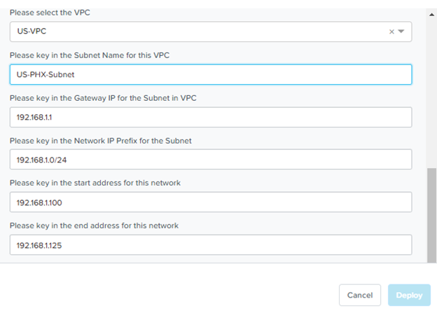

1. Once the application is \"running\". Let\'s look at the audit log.

   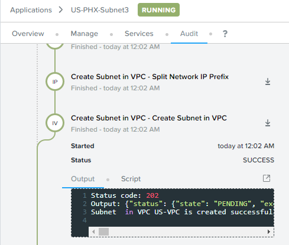

1. In Prism Central **Network and Security** **Virtual Private Cloud**, let's look at the newly created VPC

   

1. Drill into the subnet to look at its details

   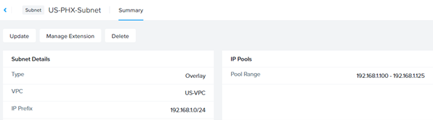

## Create a blueprint to create Tunnel VM into VPC

1. Click on **Create Blueprint**. Create a **Multi VM/Pod** blueprint.

   

1. Key in the blueprint name. Eg **tunnel_vm\_\<initial\>**
2. Select the **Credentials** tab. Create a new credential for **PC Credential** and enter desired User/Pass

   

1.  Create a new credential for **PE Credential** and enter desired User/Pass

2.  Create the following variables on the right side of the screen.

    - Variable Name: **PC_IP** Default value: **Follow the cluster PC  given by the instructor. Eg 10.x.x.x**
    - Variable Name: **PE_IP** Default value: **Follow the cluster PE given by the instructor. Eg 10.x.x.x**
   
   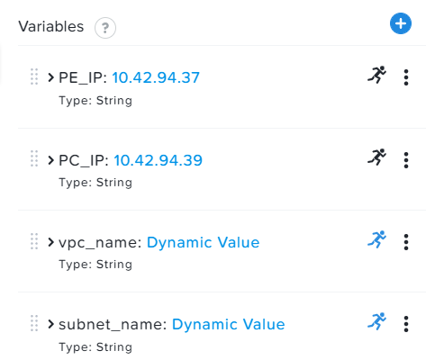

1. Create the following dynamic variable: **vpc_name** on the right side of the screen. Select Input Type: **escript**

   

1. **Replace the password with the Prism Central password.**

  ```python
  user = "admin"
  password = "xxxxxxxx"
  ip = "@@{PC_IP}@@"
  payload = {}
  base_url = "https://" + ip + ":9440/api/nutanix/v3/vpcs"
  url = base_url + "/list"
  headers = {'Accept': 'application/json', 'Content-Type': 'application/json'}
  url_method = "POST"
  r = urlreq(url, url_method, auth="BASIC", user=user, passwd=password, params=json.dumps(payload), verify=False, headers=headers)
  #print "Status code: {}".format(r.status_code)
  #print "Output: {}".format(r.text)
  vpc_list = []
  vpc_list_json = r.json()
  for vpc in vpc_list_json['entities']:
    vpc_list.append("{}".format(vpc['spec']['name']))
  print ','.join(vpc_list)
  ```

1. Create the following dynamic variable: **subnet_name** on the right side of the screen. Select Input Type: **escript**

   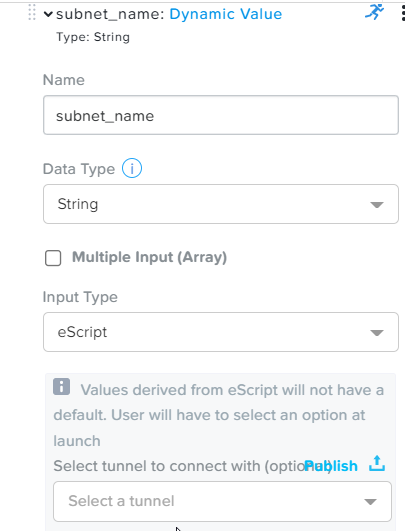

1. **Replace the password with the Prism Central password.**

  ```python
  user = "admin"
  password = "xxxxxxx"
  ip = "@@{PC_IP}@@"
  headers = {'Accept': 'application/json', 'Content-Type': 'application/json'}
  url_method = "POST"
  def get_vpc_uuid(vpc_name):
      vpc_url = "https://"+ip+":9440/api/nutanix/v3/vpcs/list"
      params={"kind": "vpc"}
      r = urlreq(vpc_url, url_method, auth="BASIC", user=user, passwd=password, params=json.dumps(params), verify=False, headers=headers)
    #  print "status code: {}".format(r.status_code)
    # print "response: {}".format(r.text)
      vpc_list_json = r.json()
      for vpc in vpc_list_json["entities"]:
        if vpc["spec"]["name"]==vpc_name:
          return vpc["metadata"]["uuid"]
      exit(1)
  vpc_uuid=get_vpc_uuid("@@{vpc_name}@@")
  payload = {
    "kind": "subnet"

  }
  base_url = "https://" + ip + ":9440/api/nutanix/v3/subnets"
  url = base_url + "/list"
  r = urlreq(url, url_method, auth="BASIC", user=user, passwd=password, params=json.dumps(payload), verify=False, headers=headers)
  #print "Status code: {}".format(r.status_code)
  #print "Output: {}".format(r.text)
  subnet_list = []
  subnet_list_json = r.json()
  for subnet in subnet_list_json['entities']:
  # print "cluster['spec']['name']"
    if subnet['spec']['resources']['subnet_type'] == 'OVERLAY' and subnet['spec']['resources']['vpc_reference']['uuid'] == vpc_uuid:
      subnet_list.append("{}".format(subnet['spec']['name']))

  print ','.join(subnet_list)
  ```

1. On the left hand side of the screen, create a service.

   

1. On the right hand side of the screen, select **Existing Machine** for account name

   

1. On the right hand side of the screen

   

1.  On the left hand side of the screen, create a service action:
    **Create Tunnel VM**

> 

1.  On the service, click **Create Task**.

> - Task Name: **Get VPC UUID**
> - Type: **Set Variable**
> - Script Type: **EScript**
> - Output: **vpc_uuid**

``` python
user = "@@{PC Credential.username}@@"
password = "@@{PC Credential.secret}@@"
ip = "@@{PC_IP}@@"
headers = {'Accept': 'application/json', 'Content-Type': 'application/json'}
url_method = "POST"

def get_vpc_uuid(vpc_name):
    vpc_url = "https://"+ip+":9440/api/nutanix/v3/vpcs/list"
    params={"kind": "vpc"}
    r = urlreq(vpc_url, url_method, auth="BASIC", user=user, passwd=password, params=json.dumps(params), verify=False, headers=headers)
  #  print "status code: {}".format(r.status_code)
   # print "response: {}".format(r.text)
    vpc_list_json = r.json()
    for vpc in vpc_list_json["entities"]:
      if vpc["spec"]["name"]==vpc_name:
        return vpc["metadata"]["uuid"]
    exit(1)
vpc_uuid=get_vpc_uuid("@@{vpc_name}@@")
print "vpc_uuid={0}".format(vpc_uuid)
```

1. On the service, click **Create Task**.

   - Task Name: **GetAccountName**
   - Type: **Set Variable**
   - Script Type: **EScript**
   - Output: **account_name**

  ``` python
  print "account_name=NTNX_LOCAL_AZ"
  ```

1. On the service, click **Create Task**.

   - Task Name: **GetAccountUUID**
   - Type: **Set Variable**
   - Script Type: **EScript**
   - Output: **account_uuid**

  ```python
  user = "@@{PC Credential.username}@@"
  password = "@@{PC Credential.secret}@@"
  ip = "@@{PC_IP}@@"
  payload = {
    "length": 250
  }
  base_url = "https://" + ip + ":9440/api/nutanix/v3/accounts"
  url = base_url + "/list"
  headers = {'Accept': 'application/json', 'Content-Type': 'application/json'}
  url_method = "POST"
  r = urlreq(url, url_method, auth="BASIC", user=user, passwd=password, params=json.dumps(payload), verify=False, headers=headers)
  account_list = []
  account_list_json = r.json()
  for account in account_list_json['entities']:
    if account['status']['name'] == "@@{account_name}@@": #sometimes this value will be '{}'
      print "account_UUID={}".format(account['metadata']['uuid'])
  ```

1. On the service, click **Create Task**.

   - Task Name: **GetSubnetUUID**
   - Type: **Set Variable**
   - Script Type: **EScript**
   - Output: **subnet_uuid**

  ``` python
  user = "@@{PC Credential.username}@@"
  password = "@@{PC Credential.secret}@@"
  ip = "@@{PC_IP}@@"
  payload = {
  }
  base_url = "https://" + ip + ":9440/api/nutanix/v3/subnets"
  url = base_url + "/list"
  headers = {'Accept': 'application/json', 'Content-Type': 'application/json'}
  url_method = "POST"
  r = urlreq(url, url_method, auth="BASIC", user=user, passwd=password, params=json.dumps(payload), verify=False, headers=headers)
  subnet_list = []
  subnet_list_json = r.json()
  for subnet in subnet_list_json['entities']:
    if subnet['spec']['name'] == "@@{subnet_name}@@":
      print "pe_network_UUID={}".format(subnet['metadata']['uuid'])
      exit(0)
  exit(1)
  ```

1. On the service, click **Create Task**.
   
    - Task Name: **GetClusterUUID** 
    - Type: **Set Variable** 
    - Script Type: **EScript** 
    - Output: **pe_cluster_uuid**

  ``` python
  user = "@@{PE Credential.username}@@" 
  password = "@@{PE Credential.secret}@@"
  ip = "@@{PE_IP}@@"
  def process_request(url, method, user, password, headers, payload=None):
    r = urlreq(url, verb=method, auth="BASIC", user=user, passwd=password, params=payload, verify=False, headers=headers)
    return r
  payload = {}
  base_url = "https://" + ip + ":9440/PrismGateway/services/rest/v2.0/cluster"
  url = base_url + "/"
  headers = {'Accept': 'application/json', 'Content-Type': 'application/json'}
  url_method = "GET"
  r = process_request(url, url_method, user, password, headers, json.dumps(payload))
  cluster_list = []
  cluster_list_json = r.json()
  print "pe_cluster_uuid={}".format(cluster_list_json['uuid'])
  ```

1. On the service, click **Create Task**.

   - Task Name: **Provision Tunnel VM** 
   - Type: **Execute** 
   - Script Type: **EScript**

  ``` python
  user = "@@{PC Credential.username}@@"
  password = "@@{PC Credential.secret}@@"
  ip = "@@{PC_IP}@@"
  headers = {'Accept': 'application/json', 'Content-Type': 'application/json'}
  url_method = "POST"
  network_group_tunnel_uuid = "{}".format(str(uuid.uuid4()))
  tunnel_uuid = "{}".format(str(uuid.uuid4()))
  payload = {
    "api_version": "3.1.0",
    "metadata": {
      "kind": "network_group_tunnel",
      "uuid": network_group_tunnel_uuid
    },
    "spec": {
      "resources": {
        "platform_vpc_uuid_list": [
          "@@{vpc_uuid}@@"
        ],
        "tunnel_reference": {
          "kind": "tunnel",
          "uuid": tunnel_uuid,
          "name": "NTNX_LOCAL_AZ_VPC_@@{vpc_name}@@_Tunnel"
        },
        "account_reference": {
          "kind": "account",
          "name": "@@{account_name}@@",
          "uuid": "@@{account_UUID}@@"
        },
        "tunnel_vm_spec": {
          "vm_name": "@@{vpc_name}@@_@@{subnet_name}@@_TunnelVM",
          "subnet_uuid": "@@{pe_network_UUID}@@",
          "cluster_uuid": "@@{pe_cluster_uuid}@@"
        }
      },
      "name": "VPC_@@{vpc_name}@@_NTNX_LOCAL_AZ"
    }
  }
  base_url = "https://" + ip + ":9440/api/nutanix/v3/network_groups/tunnels"
  url = base_url
  r = urlreq(url, url_method, auth="BASIC", user=user, passwd=password, params=json.dumps(payload), verify=False, headers=headers)
  print "Status code: {}".format(r.status_code)
  print "Output: {}".format(r.text)
  if r.ok:
    print "Successful invocation of tunnel VM"
  else:
    exit(1)
  ```

1. On the left side of the screen, click on **Package: Install**
   
   

1.  Click on **+ Action**. Associate it with **Create Tunnel VM**

2.  Let's create the service action to delete the tunnel vm. On the left hand side of the screen, create a service action: **Delete Tunnel VM**

    

1. On the service, click **Create Task**.

   - Task Name: **GetTunnelUUID**
   - Type: **Set Variable**
   - Script Type: **EScript**
   - Output: **tunnel_uuid**

  ``` python
  user = "@@{PC Credential.username}@@"
  password = "@@{PC Credential.secret}@@"
  ip = "@@{PC_IP}@@"
  headers = {'Accept': 'application/json', 'Content-Type': 'application/json'}
  url_method = "POST"
  payload = {
    "kind": "tunnel",
    "filter": "name==NTNX_LOCAL_AZ_VPC_@@{vpc_name}@@_Tunnel"
  }
  base_url = "https://" + ip + ":9440/api/nutanix/v3/tunnels/list"
  url = base_url
  r = urlreq(url, url_method, auth="BASIC", user=user, passwd=password, params=json.dumps(payload), verify=False, headers=headers)
  print "Status code: {}".format(r.status_code)
  print "Output: {}".format(r.text)
  if r.ok:
    print "Successful retrieval of tunnel VM"
    tunnel_json = r.json()
    for tunnel in tunnel_json['entities']:
      if tunnel['metadata']['name'] == 'NTNX_LOCAL_AZ_VPC_@@{vpc_name}@@_Tunnel':
        print "tunnel_uuid={}".format(tunnel['metadata']['uuid'])
        exit(0)
  else:
    exit(1)
  ```

1. On the service, click **Create Task**.
  
   - Task Name: **DeleteTunnel**
   - Type: **Execute**
   - Script Type: **EScript**

  ``` python
  user = "@@{PC Credential.username}@@"
  password = "@@{PC Credential.secret}@@"
  ip = "@@{PC_IP}@@"
  headers = {'Accept': 'application/json', 'Content-Type': 'application/json'}
  url_method = "DELETE"
  payload = {
  } 
  base_url = "https://" + ip + ":9440/api/nutanix/v3/tunnels/@@{tunnel_uuid}@@"
  url = base_url
  r = urlreq(url, url_method, auth="BASIC", user=user, passwd=password, params=json.dumps(payload), verify=False, headers=headers)
  print "Status code: {}".format(r.status_code)
  print "Output: {}".format(r.text)
  if r.ok:
    print "Successful deletion of tunnel VM"
  else:
    exit(1)
  ```

1. Associate the **Delete Tunnel VM** action with the **Package uninstall** action. Click on **+ Action**. Choose the **Delete Tunnel VM** action

2. Click on **Launch**

   

1. Enter the name of Application **TunnelVM-INITIALS** and fill out the form with the requested information. Press **Deploy**

   

1. Once the application is **running**. Let's look at the audit log.

   

1. In Calm **Accounts**, let\'s look at the tunnel VM during provisioning

   

1. Wait for a few minutes. The tunnel VM will change the state to  **Connected**

   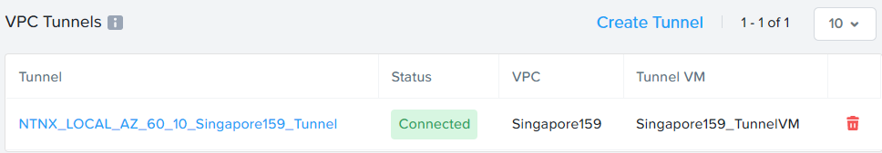

1. In Prism Central, **Compute & Storage**. Click on **VMs**

   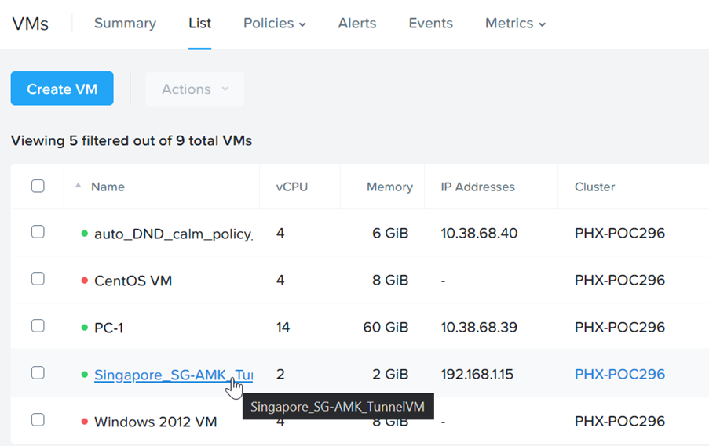
